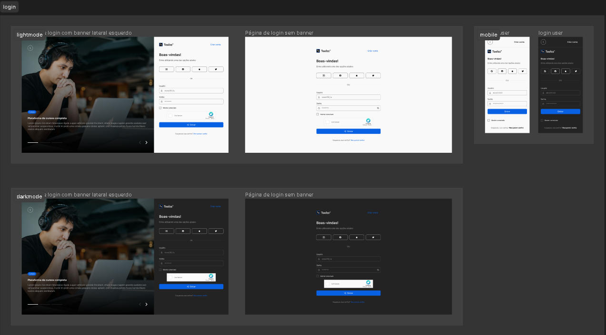

# Teste Técnico Pleno Toolzz

Bem-vindo à documentação do Teste Técnico {Pleno} Toolzz. Este é um projeto que visa avaliar conhecimentos em React, backend com Node.js e autenticação simulada para demonstrar o funcionamento básico.

## Visão Geral 

Tarefas a serem Realizadas:

### Implementação Front End:
- Converta o design fornecido do Figma em uma página web funcional.
- Mantenha alta fidelidade ao design original, incluindo layout, cores, tipografia e espaçamento.
- Garanta que a página seja responsiva e funcione bem em diferentes dispositivos e tamanhos de tela.
- Utilize ReactJS ou HTML/CSS/JavaScript para o desenvolvimento.

### Funcionalidade de Login:
- Implemente uma funcionalidade básica de login (sem autenticação real, um mock é suficiente).
- O formulário de login deve validar a entrada do usuário e fornecer feedback visual.

### Backend Simples:
- Crie uma API simples que possa receber e validar os dados do formulário de login.
- Utilize Node.js ou Laravel para a implementação do backend.

Critérios de Avaliação:

#### Fidelidade ao Design:
- A semelhança do produto final com o design do Figma será o critério mais importante.
- Detalhes como sombras, bordas, animações e comportamento interativo serão considerados.

#### Qualidade do Código:
- A clareza, organização e eficiência do código serão avaliadas.
- A aplicação de padrões de projeto e boas práticas de codificação são valorizadas, mas opcionais.

Entrega:
- O código deve ser hospedado em um repositório Git (por exemplo, GitHub, GitLab, etc.).
- Inclua um README com instruções sobre como configurar e executar o projeto.
- Forneça um link para uma versão ao vivo da aplicação, se possível.

O Figma:

## Funcionalidades Principais

- **Frontend React**: Desenvolvi quatro telas no total: duas com banner claro e escuro e duas sem banner, estas últimas sendo responsivas.
  
- **Backend Node.js**: Implementei uma autenticação simples, conforme requisitado no teste. Adicionei duas rotas: uma para cadastro e outra para login, junto com um banco de dados para tornar a experiência mais interativa.

- **Banco de Dados**: Utilizei o SQLite devido à sua simplicidade. Como o objetivo é demonstrar o conceito, acredito que seja uma solução adequada.

## Confira o resultado

[Link para a aplicação ao vivo](http://20.206.205.50:8080/)

## Configuração do Ambiente local

Para configurar o ambiente de desenvolvimento localmente, siga estas etapas:

1. **Clone o repositório**: `https://github.com/eusuario/Testes-Tecnicos.git`
2. **Após clonar o repositório, abra o seu terminal e navegue para o diretório do front-end**: `cd .\teste-tecnico-front-toolzz\`
4. **Instale as dependências do front-end**: execute `npm install`.
5. **Executando o projeto**: execute o comando `npm run dev`.
6. **Volte ao diretório raiz**: execute `cd ..`.
6. **Vá ao diretório do back-end**: `cd .\teste-tecnico-back-toolzz\`
7. **Instale as dependências do back-end**: execute `npm install`.
8. **Inicie o servidor**: No diretório raiz do projeto, execute `node .\index.js`
9. **Acesse o aplicativo**: Abra seu navegador e acesse `http://localhost:5173` para visualizar o aplicativo em execução.

## Teste do backend

Caso você queira testar o backend via Postman, na pasta do backend eu deixei uma coleção para você importar.

## Licença

Este projeto está licenciado sob a [MIT License](LICENSE).
